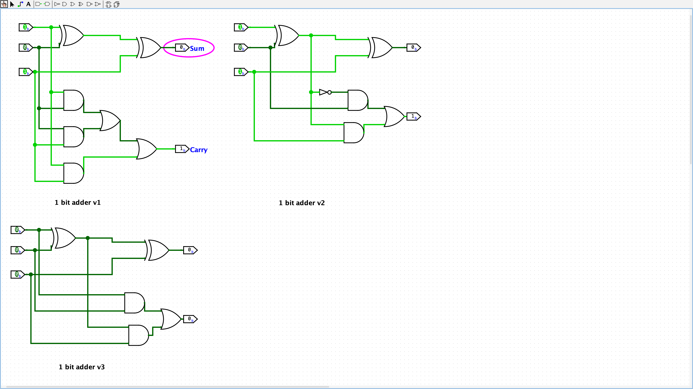

# 8 Bit Adder

I want to build an 8 bit adder using transistors as my first
electronics project.

## 1 Bit Adder

An 8 bit adder is composed of a series of 1 bit adders chained together.
A 1 bit adder is a function that maps input bit a, input bit b, and the
input carry bit to the sum bit and the output carry bit.
Here's the definition

| IA  | IB  | IC  | OSUM | OC  |
| --- | --- | --- | ---- | --- |
| 0   | 0   | 0   | 0    | 0   |
| 1   | 0   | 0   | 1    | 0   |
| 0   | 1   | 0   | 1    | 0   |
| 0   | 1   | 1   | 1    | 0   |
| 1   | 1   | 0   | 0    | 1   |
| 1   | 0   | 1   | 0    | 1   |
| 0   | 1   | 1   | 0    | 1   |
| 1   | 1   | 1   | 1    | 1   |

### Digital Circuit Diagram

I didn't want to look up how this was done so I built the following versions in
Logisim Evolution. I wanted to see if I could simplify the circuit after
each revision. I think version 1 is most straightforward
while version 3 is the most elegant.



Logic gates are a fine level of abstraction, but I'd like
to understand how logic gates themselves are implemented, so we will need
to lower this. I'd like to do this at the resistor-transistor logic (RTL)
level of abstraction.

### Schematic

You can view the schematic in its entirely here. Made with [KiCad](KiCad.com).

[./1_bit_adder_rtl/assets/1_bit_adder_image.pdf](./1_bit_adder_rtl/assets/1_bit_adder_image.pdf)

### Real Life: On A Breadboard

I got the full 1 bit adder with transistors working on a breadboard!
It uses a 5V power supply.
Per the digital diagram above, it takes

- 2 XOR Gates
- 2 AND Gates
- 1 OR Gate

To build a full 1 bit adder. Perhaps there is a way to use fewer gates,
I do not know of one.

I decomposed the XOR gate into

    a XOR b = (a OR b) AND (NOT (a AND b))

#### OR Gate RTL

The OR gate uses

## Building Logic Gates at RTL level

The 1 bit adder uses `AND`, `OR`, `XOR`, and version 2 uses `NOT`.
`XOR` can be constructed uses `AND`, `OR`, `NOT` gates.

```ascii
a XOR b = (a OR b) AND (NOT (a AND b))
```

I am not sure if it can be done more simply than that.
At any rate, this means we have to construct the `AND`, `NOT`, and `OR`,
gates uses transistors and we get `XOR` for free by composing them.

### AND Gate

I was thinking why couldn't I have

```ascii

(Input 2)
|
v | (<--- Input 1)
- T
  | (<--- Output)
```

## Learning KiCad

Reference is here: [https://docs.kicad.org/7.0/en/getting_started_in_kicad/getting_started_in_kicad.html#sym-lib-table-setup](https://docs.kicad.org/7.0/en/getting_started_in_kicad/getting_started_in_kicad.html#sym-lib-table-setup)

### Tutorial Part 2: Schematic

#### PWR_FLAG

KiCad says this:

    In this case, KiCad reports "Input Power pin not driven by any Output Power pins" for both the VCC and GND nets. This is a common KiCad ERC error. Power symbols are set up to require a power output pin, such as the output of a voltage regulator, on the same net; otherwise KiCad thinks the net is undriven. To a human, it is obvious that VCC and GND are driven by the battery, but it’s necessary to explicitly show that in the schematic.

### Questions

- What are reference designators (called ref desgs)?
- What's a netlist? Just the whole thing?

Footprints tell you how your component will attach to the PCB.

XOR Gate, Why is voltage 3 at output: [http://tinyurl.com/27m9rpqs](http://tinyurl.com/27m9rpqs)
